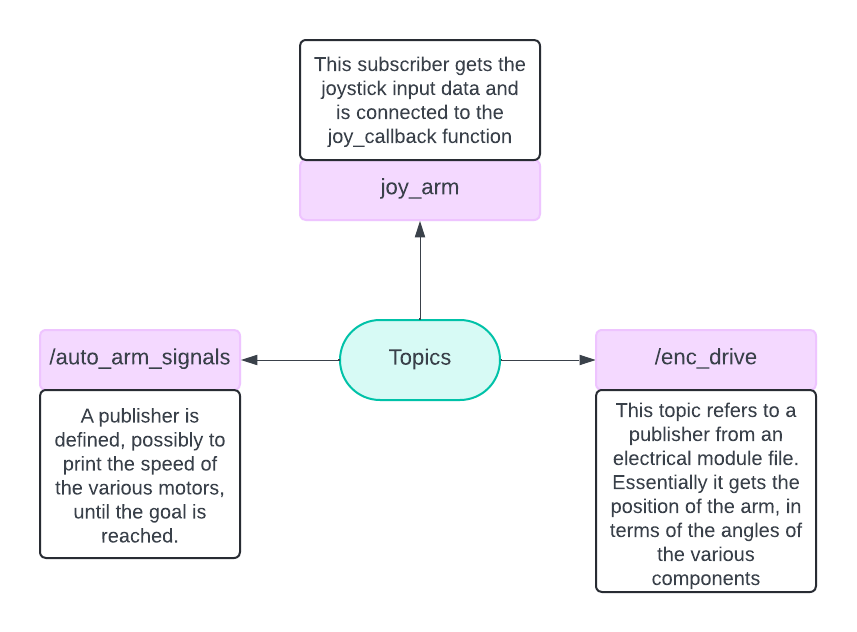

# Anveshak Documentation
## Differential_controller (by Pranav)


# Purpose Of The Code
This code aims to allow the arm to reach the goal by using joystick movement. We are able to change the goal in real time(slight delay due to time taken for motion to occur and calculations). This allows the arm to move along one particular axis and thus reach the goal in an easier manner than if one was to control each of the base, shoulder and elbow individually.


# Variable Intuition and Naming Convention - 
## Class variables
`self.goal` - It is a list that holds the 3 dimensional position of the goal.

`self.kpwm` - A list of linear velocities to shift the goal by, upon receiving input from the joystick.

`self.enc_data` - Holds the angular values of the current positions of Base, Shoulder and Elbow.

`self.q1`, `self.q2`, `self.q3` - They are used during the computation of the angular position of the goal.

`a1`, `a2` - The length of the links

# Functions and Flow control
## class IK_IROC
All functions belonging to this class have been assumed to have a parameter named self by default, unless explicitly mentioned

### __init__() - 
Defines the initial values of various variables.

### joyCallback(msg) - 
This is a callback from the 'joy_arm' topic. The msgs are of the type Joy, which is used to get data from the joystick.
- `joy.axes[0]` => refers to left stick horizontal
- `joy.axes[1]` => refers to left stick vertical
- `joy.axes[2]` => refers to right stick horizontal
- `joy.axes[3]` => refers to right stick vertical

Using the input from joystick we move the goal to the required position. 

### angle_value() - 
`x, y, z` have been defined that hold the goal's coordinates. 

```python
if(abs((x**2+y**2+z**2-a1**2-a2**2)/(2*a1*a2)) <1):
            self.q3 = math.pi/2
            self.q2 = -math.acos((x**2+y**2+z**2-a1**2-a2**2)/(2*a1*a2))
            self.q1 = math.atan(z/math.sqrt(x**2+y**2)) + math.atan((-a2*math.sin(self.q2))/(a1+a2*math.cos(self.q2)))
        if(y != 0):
            self.q3 = math.atan(x/y)
```

`abs((x**2+y**2+z**2-a1**2-a2**2)/(2*a1*a2)` - refers to the cos value at the shoulder, which should be less than 1 to proceed.

Here, `theta1`, `theta2` and `theta3` have been defined which are with respect y-axis.

`theta1` - It is the angle of the goal coordinate, with the base, as measured from y-axis
`theta2` - It is the angle of the first link (between base and shoulder), with the y-axis
`theta3` - It is the between the second link and the first link extended.


We later convert these angular values to degrees and store them in variables called, 
`base`, `shoulder`, `elbow`

Now the angles values we create a `Int32MultiArray()`, which stores the angular velocity values, basically, the rover keeps publishing until the base, shoulder and elbow values are all under 3 degree treshold.

### enc_callback() -

Used to get the encoder data, which refers to readings of the base, shoulder and elbow.

