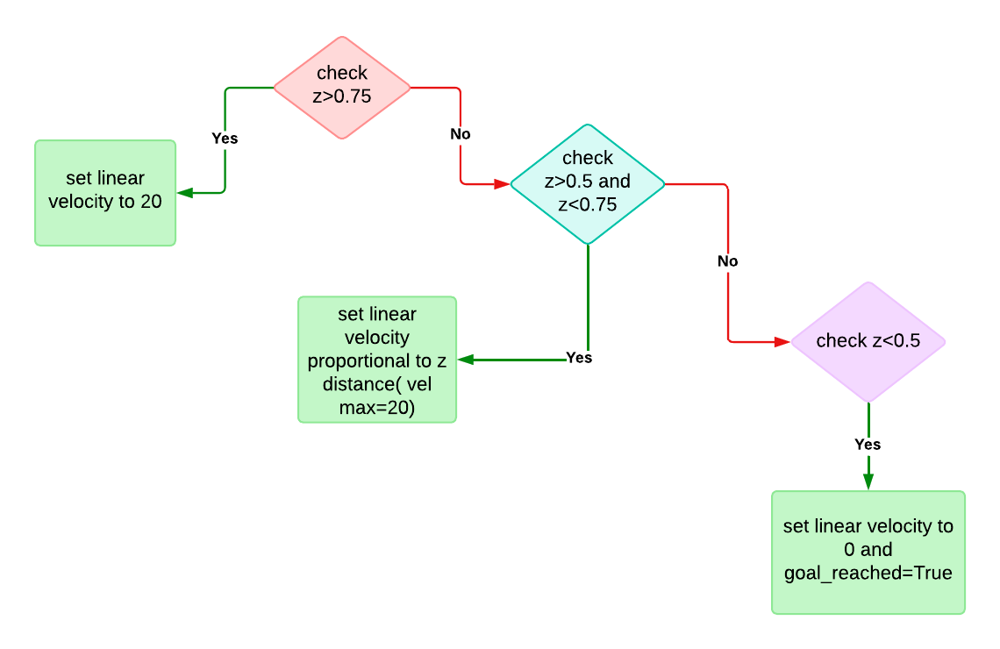
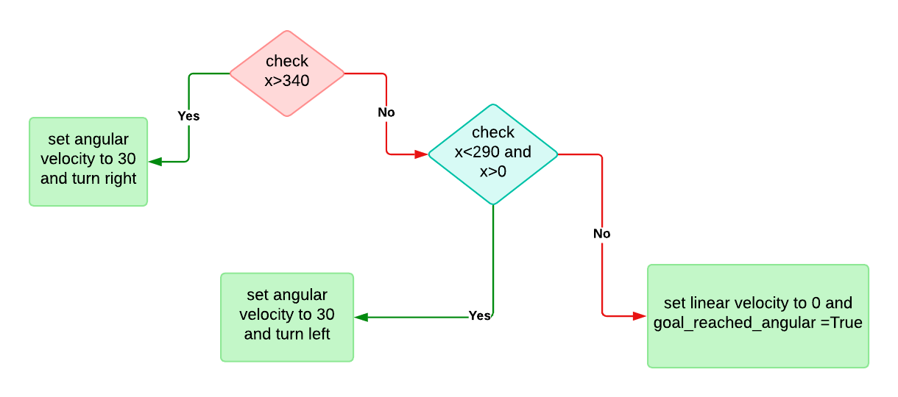

# This file helps in understanding the iroc_centre.py script.

## Imports 
   - rospy
   - numpy
   - cv2(OpenCV)
   - imutils(helpful for image processing)
   - tf
   - cvBridge(for interfacing ros with opencv)
   - ros msgs like std_msgs, geometry_msgs, sensor_msgs
   - traversal(custom package)

## Control Flow
* Creation of a class named `find_centre()`.

The `find_centre()` class aims to get the central part of an image of a blue goal cylinder. It controls the rover's velocity to reach the goal accordingly.

1. Initialization:

    - **iroc_centre** ROS node is created.
    - The `find_centre()` class is instantiated.
    - Subscribed to the necessary ros topics.
    - Attributes are created in the constructor.

2. Image Processing:
    - The `contour` method is called when new image data is available.
    - The method converts the image to HSV color space and applies morphological operations to isolate the target feature.
    - Contours are detected, and the largest contour by area is identified.
    - A bounding box is drawn around the largest contour.

3. Depth Analysis:
    - Depth values along the vertical centerline of the detected contour are analyzed to find significant transitions.
    - Differences in depth values are calculated to identify critical points. These are the points where the depth value changes sign.

4. Feature Localization:
    - If enough significant transitions are found, the center point of the contour is calculated.
    - The `get_depth` method is used to obtain depth values at these key points.
    - The `get_coords` method calculates the 3D coordinates of the center point.

5. Rover Control:
    - A `Float32MultiArray` message (`msg`) is prepared with the coordinates of the target.
    - A `WheelRpm` message (`g`) is prepared to control the rover's movement.
    - Based on the position and depth data, appropriate velocities and angular velocities are calculated and published to "motion" topic to move the robot towards the target.

6. Goal Publishing:
    - If the target coordinates are valid, they are published to the "arm_goal" topic.
    - The `ik_start_drop` subscriber can be used to trigger whether to drop the cylinder at the goal.

7. Loop and Feedback:
    - The process repeats with new image data, continually updating the rover's movements towards the detected feature.

## Subscribers

- `/zed2i/zed_node/rgb/image_rect_color`:  Provides a colour rectified image.
- `/zed2i/zed_node/depth/depth_registered`: Provides depth information in the image
- `/ik_start_drop`: Provides Boolean value to drop cylinder to goal using manipulator.

## Publishers

- `self.velocity_pub`: Publishes the velocity obtained using `WheelRpm()` to a topic - "motion".
- `goal_pub`: Publishes the `msg` array to a topic - "arm_goal".

## Variables

- `blue_hsv`: HSV conversion of image.
- `ker`: A kernel is created and is used to apply morphological operations on the image.
- `mask`: A mask is applied based on the `self.down` and `self.up` lists and `ker` is used to apply morphological operations on the image.
- `area`: An array that holds the value of the area of each contour found.
- `z`: Holds the value of the area of the largest contour.
- `Y`: holds the value of the y coordinate and increments it by 1 as long as it is less than the midpoint of the bounding rectangle drawn.
- `msg`: A `Float32MultiArray()` that holds the x,y,z coordinates of the centre of the cylinder.
- `g` : Instance of WheelRPM ROS message.
- `f_x` and `f_y`: They represent the focal length of the camera in the x and y directions, respectively(in pixels).
- `c_x` and `c_y`: Coordinates of the optical centre of lens in x and y directions, respectively(in pixels).

## Attributes and Methods:

- `self.up` and `self.down`: Defines the colour range for masking.
- `self.ik_start_drop` : Defines whether to drop the cylinder into the goal.
- `self.Y_array` : Array storing all the y-coordinates of bounding rectangle along centre line.
- `self.D_array`: Array storing all the depth transitions.
- `self.p_x` and `self.p_y`: Attributes which store the midpoint of cylinder.
- `self.check`: Array storing only the critical depth transitions.
- `self.goal_reached`: Boolean value checking whether the goal has been reached.
- `self.goal_reached_angular`: Boolean value checking whether the goal has been reached angularly -> checks whether the goal is within some certain threshold angles.


1. `get_transform()`: Method which listens and gets the transforms.

2. `get_cframe()` and `get_dframe()`: Methods which covert ros msgs into OpenCV images using CVBridge package.(colour image and depth image)

3. `get_depth()`: Method which returns the depth for any (x,y) coordinate in the image using `self.dframe`.

4. `get_coords()`: Method which returns the 3D coordinates of the centre of cylinder using the intrinsic parameters of camera and depth values at centre point.

### Contour() method:

- Obtains the cframe and dframe. It processes the image by converting from RGB to HSV and then applies morphological operations for masking. Contours are found and a bounding rectangle is drawn over the contour of maximum area.

- Now, the centre of the cylinder along the x-axis is found. The difference in depth values are found between 2 consecutive points on the central vertical line. If 2 consecutive depth difference values have opposite signs, they are treated as a critical value and stored in the `self.check` array.

- if `self.check` has at least 3 critical points, coordinates are found of the centre of the cylinder where the y coordinate is the average of first two critical points. `get_coords()` method is called and we approximate the depth by averaging `self.d1` and `self.d2` while accounting for a small correction factor (possibly representing a known distance between two points). The following formulae in the code convert the 2D `p_x` and `p_y` into the 3D coordinates.
```python
def get_coords(self):
        f_x=527.2972398956961
        f_y=527.2972398956961
        c_x=658.8206787109375
        c_y=372.25787353515625
        self.d=np.sqrt(0.5*(self.d1**2+self.d2**2-(0.15**2)/2))
        self.cord_x=self.d*(self.p_x-c_x)/f_x
        self.cord_y=self.d*(self.p_y-c_y)/f_y
        self.cord_z=self.d
```
- A `Float32MultiArray` named `msg` is declared with an offset of 0 and having a size and stride both equal to the length of the array. `msg` holds the x,y,z coordinates of the centre of the cylinder.

- Based on the z coodinate(obtained from msg), `g` gets a certain velocity. The z coordinate points to the depth or the distance between the camera and the cylinder. Based on how far the camera is from the cylinder, `g` is given different velocities. Once the z coordinate is small enough `self.goal_reached` is set to `True`. The below flowchart demonstrates the same:




- Similarly, based on how far left or right the centre of the cylinder is(obtained from the x coordinate of the centre of the cylinder) `g` is given a certain angular velocity. The camera lens is of dimensions 640x480, so midpoint of camera is at 320. Thus, the centre of cylinder should be in 290-340 range of camera, so the rover rotates accordingly. When the centre of the cylinder is directly in front of the camera `self.goal_reached_angular` is set to `True`.



- After this `g` is published to `self.velocity_pub` and if both y coordinate and z coordinate present in `msg` are not 0, the `msg` array is published to `goal_pub`.

## Suggestions and Changes

+ Code sectioning: Instead of doing all the control operations under the single `contour()` method, we could split it into various functions which improves readability and understanding of the code to an outsider. 
+ Variable naming: Variable names like `g`,`c_x/c_y`,`p_x/p_y` could be named differently to improve readability.
+ Commenting the code is necessary to ensure understanding of the code later.
+ Implement try-except blocks for cvBridge section, also need to do `None` handling of images.


