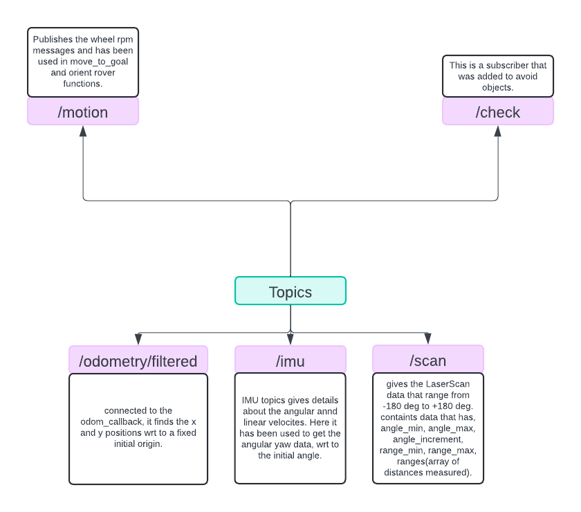

# Anveshak Documentation
## newer_go_to_goal_flag.py




# Variable Intuition and Naming Conventions

## Class Variables

```self.tensor```: Holds lidar distance data.

```self.x```,``` self.y```, ```self.theta```: Current position and orientation of the robot.

```self.goal_x```, ```self.goal_y```: Goal coordinates.

```self.vel_msg```: An instance of Twist for velocity commands.

```self.count```: Counter for iterations.

```self.object_in_front```: Boolean flag indicating if an obstacle is detected.

```self.turn_over```: Boolean flag indicating if the turn maneuver is completed.

```self.first_stop```, ```self.second_stop```, ```self.third_stop```: Flags to indicate the progress through the three main checks.


Subscriber - Publisher Relationship
Subscribers:
 
```/scan```: Subscribes to ```LaserScan``` messages to get obstacle distances.

```/odom```: Subscribes to ```Odometry``` messages to get current position and orientation.

```/goal```: Subscribes to ```Point``` messages to get the goal coordinates.
Publishers:
 
```/cmd_vel```: Publishes ```Twist``` messages to control the robot's linear and angular velocities.

# Functions and Flow control
### Class GoToGoal - 

**All the functions that belong to this class by default have assumed contain an input variable called self**

### __init__():
	Defines the various variables in the class

### check_callback() - 
	This is a callback belonging to the check subscriber, basically it is called, to avoid an object

### laser_callback() - 
Basically, msg.ranges refers to an array with distances measured by the laser scanner, it is inf. when no object was detected, else it is a finite quantity. ```angle_min``` and ```angle_max``` refer to the start and end angles.
The scans are from -180 deg. to +180 deg. so, ```right_45``` means 45 deg. to the right.

### moving_average_filter() -
Used to calculate a moving average of the data points it will help in reducing the noise while preserving the essential filters. This also adds stability of measurements, basically it takes a window around each point and calculates the average.


### depth_callback() -
Used to display the image as seen by intel depth camera, although its subscriber has been commented out.

### angle_callback() - 
Takes angle values from IMU, returns the angle turned by the rover, from the initial angle(reference), we are considering the yaw angles only.

### odom_callback() -
Takes the odometer values and finds the current position wrt an origin (reference)

### get_angles(```desired_angle```,``` rotation_dir```) -
Given an angle and the direction to rotate in, it will turn that way. The turning happens at a constant speed.

### orient_rover() - 
Used to align the rover along a direction so that the number of objects to the right less than 6m and to the left less than 6m is the same, this essentially will prevent the rover from hitting random objects.

### check_if_object_in_front() - 
Used to check if there are objects at a distance of less than 1.5 m in front of the object. It concludes that an object is in front only when the number of points in front is more than 40.


### move_straight(vel, count=0) -
Takes in the velocity of the wheel and starts moving accordingly, if there is an object in the front, then no movement, else, it moves on.

### move_to_goal() - 
There is a variable called self.count, which essentially describes, number of iterations of forward movement. Depending on the value of this variable, we have multiple choices =>
```python
          if self.count < 20:
            vel_msg = self.move_straight(1)
```
```self.count < 20``` and there is an object in front then it sets various values to its default.
```python
            elif self.count >=20 and self.object_in_front == True: 
            self.count = 0
            self.turn_started = False
            self.turn_over = False
            self.second_stop = False
            self.third_stop = False
            self.first_stop = False
            self.object_in_front = False
            vel_msg.vel = 0
            vel_msg.omega  = 0
```
When ```self.count``` >= 20 and an object is detected in front of the rover (```self.object_in_front``` == True), several flags are reset, including ```self.count```, which is set back to 0. This indicates that the rover needs to stop and handle the obstacle before continuing its journey.

```python
             elif self.first_stop == False and self.third_stop == False:
            if(self.turn_over == False): #turning over
                print(self.left_90, self.middle_0)
                a_straight = self.tensor[self.right_45:self.left_90]
                a = a_straight<2.0
                a_prime = torch.nan_to_num(a, posinf = 500, neginf = 500).to(device)
                a_with_dist = torch.nonzero(a_prime).to(device)

                print(f"Turning now. Number of points: {a_with_dist.size(dim=0)}")
                if(a_with_dist.size(dim=0) >10):
                    if(self.turn_timing_count_start == False):
                        self.last_time_turn = time.time()
                        self.turn_timing_count_start = True
                    else:
                        self.time_turn = self.time_turn + time.time()-self.last_time_turn
                        self.last_time_turn = time.time()
                    print(f"Time of turning = {self.time_turn}")
                    vel_msg.omega = self.turn_speed

                elif self.turn_over == False:
                    vel_msg.omega = 0
                    self.turn_over = True
```
If an Obstacle is detected then it analyzes the lidar data (```self.tensor[self.right_45:self.left_90]```).
If there are more than 10 points indicating obstacles within 2 meters, the rover continues turning (```vel_msg.omega``` = ```self.turn_speed```).The rover keeps track of the turn timing.
If turning is no longer needed, it stops turning (```vel_msg.omega``` = 0) and sets ```self.turn_over``` =True.


```python
              else:
                a_straight = self.tensor[self.right_90:self.middle_0]
                #print(a_straight)
                a = a_straight<2.5
                a_prime = torch.nan_to_num(a, posinf = 500, neginf = 500).to(device)
                a_with_dist = torch.nonzero(a_prime).to(device)
                self.check_if_object_in_front()
                
                print(f"Second Turn: Number of points less than 2.5m: {a_with_dist.size(dim=0)}")
                print("Second Turn Happening")
                
                if(a_with_dist.size(dim=0)>15):
                    vel_msg.vel = self.move_speed
                    self.displacement_y = self.displacement_y + math.sin(self.yaw_angle)#self.time_turn
                    print(f"Y Displacement = {self.displacement_y}")
                    vel_msg.omega  = 0
                else:
                    self.first_stop = True
                    if(self.displacement_y < 10):
                        self.y_disp_too_less = True
                    self.turn_over  = False
                    vel_msg.vel = 0
                    vel_msg.omega = 0
                    self.turn_timing_count_start = False
```
Now further the rover checks lidar data for obstacles within 2.5 meters (```self.tensor[self.right_90:self.middle_0]```).If obstacles are detected, it moves forward while avoiding them (```vel_msg.vel``` = ```self.move_speed```).If no obstacles are detected, it sets ```self.first_stop``` = True.

         
```python
        elif self.first_stop == True and self.second_stop ==False and self.third_stop == False:
            self.check_if_object_in_front()
            a_prime = torch.nan_to_num(self.tensor[self.right_90:self.middle_0], posinf = 500, neginf = 500).to(device)
            #print(a_prime)
            dist_to_chk = 1.0
            if(self.y_disp_too_less == True):
                dist_to_chk = 2.0
            a = a_prime < dist_to_chk
            a_with_dist = torch.nonzero(a).to(device)
            print(a_with_dist.size())
            vel_msg = WheelRpm()
            
            if(abs(self.displacement_y) < 20) and self.y_disp_too_less == False:
                self.third_stop = True
            if(self.y_disp_too_less == True) and self.displacement_y > 10:
                self.y_disp_too_less = False
            
            if(a_with_dist.size(dim=0) > 10): #and self.current_pose_y > 0.05):
                vel_msg.vel = self.move_speed
                self.displacement_y = self.displacement_y + math.sin(self.yaw_angle)#self.time_turn
                vel_msg.omega  = self.turn_speed
                if(self.turn_timing_count_start == False):
                    self.last_time_turn = time.time()
                    self.turn_timing_count_start = True
                else:
                    self.time_turn = self.time_turn + time.time()-self.last_time_turn
                    self.last_time_turn = time.time()

                print("Obstacle detected!")
                print(f"Time of turning = {self.time_turn}")
                print(f"Y Displacement = {self.displacement_y}")

                #elif self.current_pose_y > 0.05:
            else:
                vel_msg.vel = self.move_speed
                self.displacement_y = self.displacement_y + math.sin(self.yaw_angle)#self.time_turn
                vel_msg.omega = -self.turn_speed
                if(self.turn_timing_count_start == False):
                    self.last_time_turn = time.time()
                    self.turn_timing_count_start = True
                else:
                    self.time_turn = self.time_turn - time.time()+self.last_time_turn
                    self.last_time_turn = time.time()

                print("No obstacle. Following wall")
                print(f"Time of turning = {self.time_turn}")
                print(f"Y Displacement = {self.displacement_y}")
```
The rover checks the lidar data to decide the next move.It adjusts the distance to check based on ```self.y_disp_too_less```.If obstacles are detected, it continues moving and adjusting (```vel_msg.vel``` = ```self.move_speed```, ```vel_msg.omega``` = ```self.turn_speed```).
If no obstacles are detected, it follows the wall while updating displacement and turn timing.


```python
            elif self.third_stop == True:
            if(self.turn_over == False):
                if(self.yaw_angle <0):
                    vel_msg = self.get_angles(0,1)
                else:
                    vel_msg = self.get_angles(0,-1)
                print("Aligning to zero degrees. Turn Over? ", self.turn_over)
            else:
                vel_msg.vel = 0
                vel_msg.omega = 0
```
If  ```self.third_stop``` == True and further if ```self.turn_over``` == False then the rover aligns itself to zero degrees using ```self.get_angles(0,1)``` or ```self.get_angles(0,-1)```.If the rover is aligned then the rover stops completely (```vel_msg.vel```= 0, ```vel_msg.omega``` = 0).
