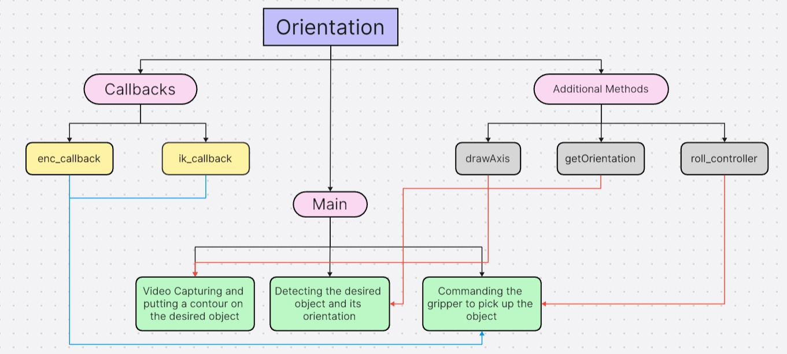

# orient_roverH
this is repository to explain orient_o file 

# Initialisation 
Initializes the script as a ROS node with name `go_to_goal`.




## Subscribers
- Subscribes to encoder readings on the topic `/enc_drive` (gets encoder data from motor)
- Subscribes to data on the topic `ik_over_ah` (this basically gets data to execute roll_controller or not)

## Publisher
- Publishes to topic `auto_arm_signals` of type Int32MultiArray
- Publishes to topic `goal_reached_pub` of Bool type

## Variables used
- `ik_bool` , `ret` : Boolean to check whether we detected the desired object
-  `enc_angle` : variable that stores the angle received from encoder data 
-  `angle_memory`: stores the initial orientation of the object
-  `small_res` : resized image
-  `angle` keeps the orientation of the object
-  `angle_temp` keeps the angle used in draw axis function
-  `self.a` is variable used so that conversion from radian to degree is only done once
-  `roll_constant` gets data from encoder 


# Methods used

## ik_callback
this method sets the `ik_bool` variable to true to falls based on which `roll_controller()` will be called 
``` python
self.ik_bool = msg.data
```
## enc_callback
this method is used to set the variable `enc_angle` to the roll data recieved from the encoder 
``` python
self.enc_angle = msg.data[self.roll_constant]
```
## drawAxis
this method takes center(cntr) of the object and end point of one the edges(p1 and p2) in the pca direction to draw axes on the image 
in the code this method is used twice to get perpendiculars axes

``` python

def drawAxis(self, img, p_, q_, colour, scale):		#to draw a lines along the desired object
		p = list(p_)
		q = list(q_)
		angle = math.atan2(p[1] - q[1], p[0] - q[0])
		hypotenuse = math.sqrt((p[1] - q[1]) ** 2 + (p[0] - q[0]) ** 2)
		q[0] = p[0] - scale * hypotenuse * math.cos(angle)
		q[1] = p[1] - scale * hypotenuse * math.sin(angle)
		cv.line(img, (int(p[0]), int(p[1])), (int(q[0]), int(q[1])), colour, 1, cv.LINE_AA)
		p[0] = q[0] + 9 * math.cos(angle + pi / 4)
		p[1] = q[1] + 9 * math.sin(angle + pi / 4)
		cv.line(img, (int(p[0]), int(p[1])), (int(q[0]), int(q[1])), colour, 1, cv.LINE_AA)
		p[0] = q[0] + 9 * math.cos(angle - pi / 4)
		p[1] = q[1] + 9 * math.sin(angle - pi / 4)
		cv.line(img, (int(p[0]), int(p[1])), (int(q[0]), int(q[1])), colour, 1, cv.LINE_AA)
```
## getOrientation 
This method gets the orientation of the object using PCA and returns the direction pointed of the eigenvector with the highest variance basically giving the direction of the length of object , it even makes a circle of radius 3 and thickness 2 around the circle with the center of object being the center of the circle 

``` python
def getOrientation(self, pts, img):		#to get the orientation of a contour
		sz = len(pts)	#finding the number of points in the contour
		data_pts = np.empty((sz, 2), dtype=np.float64)	#initializing a numpy array to store the coordinates of contour points
		for i in range(data_pts.shape[0]):
			data_pts[i, 0] = pts[i, 0, 0]
			data_pts[i, 1] = pts[i, 0, 1]
		mean = np.empty((0))
		mean, eigenvectors, eigenvalues = cv.PCACompute2(data_pts, mean)	#eigenvector correspoding to the highest eigenvalue is the orientation in PCA calculation
		# PCA compute makes covariance matrix x* x(transpose) and gets its eigen values and eigen vecots 
		cntr = (int(mean[0, 0]), int(mean[0, 1]))               # finds center of the object using mean of the data points 
		cv.circle(img, cntr, 3, (255, 0, 255), 2)
		p1 = (cntr[0] + 0.02 * eigenvectors[0, 0] * eigenvalues[0, 0], cntr[1] + 0.02 * eigenvectors[0, 1] * eigenvalues[0, 0])   # uses the largest eigenvalues corresponding eigenvector to get length
		p2 = (cntr[0] - 0.02 * eigenvectors[1, 0] * eigenvalues[1, 0], cntr[1] - 0.02 * eigenvectors[1, 1] * eigenvalues[1, 0])  # uses the second largest eigenvalues corresponding eigenvector to get width	
		self.drawAxis(img, cntr, p1, (0, 255, 0), 1)          # draws the required axes in lenght
		self.drawAxis(img, cntr, p2, (255, 255, 0), 5)        # draws perpendicular axes in width 
		angle = math.atan2(eigenvectors[0, 1], eigenvectors[0, 0])
		return angle
```
## roll_controller
This method starts the gripper motion and moves it according to the orientation data of the detected object we get from the video feed
``` python
if not math.isnan(self.angle):
			msg=Int32MultiArray()
			msg.data=[0,0,0,0,0,0]
			msg.layout = MultiArrayLayout()
			msg.layout.data_offset = 0
			msg.layout.dim = [MultiArrayDimension()]
			msg.layout.dim[0].size = msg.layout.dim[0].stride = len(msg.data)
			msg.layout.dim[0].label = 'write'

			print("Angle:", self.angle)
			if self.enc_angle < self.angle - 2:   # defining this as anticlockwise rotation
				msg.data[5] = -255
				print("roll angle:", self.enc_angle)
			elif self.enc_angle > self.angle + 2:
				msg.data[5] = 255
				print("roll angle:", self.enc_angle)
				self.rate.sleep()
			self.vel_pub.publish(msg)
			gripper_pub = 3 #set this to actual gripper publishing value while testing
			if abs(self.enc_angle - self.angle) < 2:
				msg.data[gripper_pub] = 255  #determine sign as per closing and opening
				self.vel_pub.publish(msg)
				rospy.sleep(5)
				self.om_pub.publish(True)
```

## Main
First captures video feed 

``` python
cap = cv.VideoCapture(3)	#capturing video from the camera
if not cap.isOpened():
	print("Error: Failed to open camera.")
	exit()
while True:
	ret, frame = cap.read()
	if not ret:
		print("Error: Failed to capture frame.")
		break
```
Inside the while loop, we detect contours within a certain colour range and have decent area. We then get the orientation of the detected object and offset it

```python
	hsvFrame = cv.cvtColor(frame, cv.COLOR_BGR2HSV)
	lower = np.array([0, 70, 50], np.uint8)  #RED OBJECT
	upper = np.array([10, 255, 255], np.uint8)

	#This is for orange colour cone
	#lower = np.array([0, 55, 228], np.uint8)
	# upper = np.array([21, 255, 255], np.uint8)

	mask = cv.inRange(hsvFrame, lower, upper)
	red_output = cv.bitwise_and(frame, frame, mask=mask)
	gray = cv.cvtColor(red_output, cv.COLOR_BGR2GRAY)
	_, thresh = cv.threshold(gray, 10, 255, cv.THRESH_BINARY | cv.THRESH_OTSU)
	contours, hierarchy = cv.findContours(thresh, cv.RETR_TREE, cv.CHAIN_APPROX_SIMPLE)
	angle_memory = None
	if self.angle != None:
		angle_memory = self.angle
	for i, c in enumerate(contours):	# enumerate() gives us the index and value of an element in an array
		area = cv.contourArea(c)           
		if area < 1e4:
			continue
		else:
			print(area)
			cv.drawContours(frame, contours, i, (0, 255, 255), 4)
			angle = self.getOrientation(c, frame)
			
			if self.a != 0 and angle != 0.0:
				rospy.sleep(2)
				self.angle = angle * 180/pi	#getting the angle in degrees
				self.a = 0
			if self.angle > 0:	#offsetting
				self.angle = 90 - self.angle
			elif self.angle < 0:
				self.angle = -90 - self.angle
			
			self.ret = True
```

In the above code we convert the data to degree only once using self.a temporary variable, then its offsetted(to change the reference frame).

in the code below is memory angle and angle sum to 90 degrees, then self angle is kept to the lower of the 2 values, if it doesnt sum to 90 then just set self.angle to angle memory and continue forward


```python
	if angle_memory != None and self.angle != None:	
		if angle_memory + self.angle <= 91 and angle_memory + self.angle >= 89:
			if angle_memory < self.angle:
				self.angle = angle_memory
		elif angle_memory + self.angle >=-91 and angle_memory + self.angle <= -89:
			if angle_memory < self.angle:
				self.angle = angle_memory
		else:
			self.angle = angle_memory
```

After capturing the object, we call `roll_controller()` to activate gripper motion

```python
	if self.ret == True and self.ik_bool == True:
		self.roll_controller()
```
Resizing the image and outputting it
```python
	small_res = cv.resize(frame, (640, 480))	#resizing the image and printing it
	cv.imshow('contours', small_res)
	if cv.waitKey(1) & 0xFF == ord('q'):
		break
```

Finally killing the video feed

```python
cap.release()	#closing video feed
cv.destroyAllWindows()
```
# Changes 
- `pranav_callback` --> `ik_callback`
- `pranav_bool` --> `ik_bool`
- `om_pub` --> `goal_reached_pub`
- `angle` in `drawAxis` renamed to `angle_temp` to avoid confusion with angle in get orientation which is used in main function 
