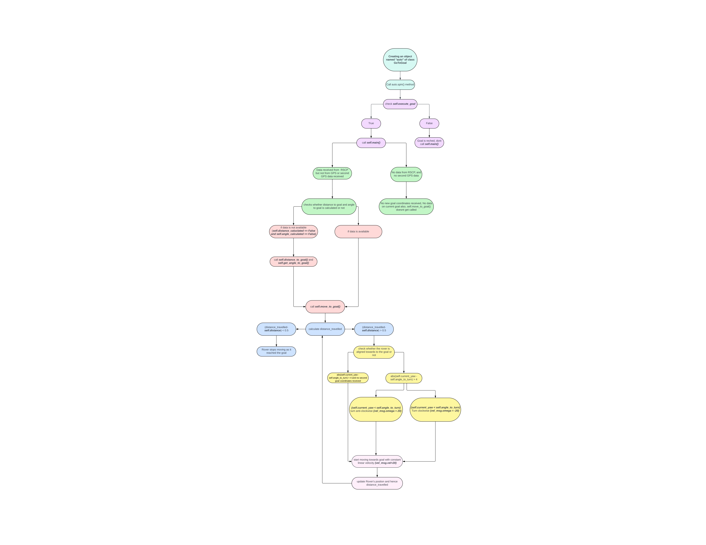

# nav2_roverH
This repository is to store documentations


# Initialisation 

Initializes the script as a ROS node with name `go_to_goal`.
## Subscribers
- Subscribes to Odometer on the topic `/odometry/filtered`
- Subscribes to GPS on the topic `/gps_coordinates`
- Subscribes to IMU on the topic `/imu`
- Subscribes to Comms on the topic `/rscp_dat`


## Publisher
Publishes to topic `vel_msg`

## Variables used
- `dummy` is a temporary variable used to store direction to turn in `Angle to goal` function
- `odom_self` stores the current reading on odometer in a list [x,y]
- `initial_odom` stores the value on odometer at the start point
- `angle_req` is a variable in angle to goal function to signify how much to rotate from current rotation
- `a` is a variable used in the haversine formula in distance_to_goal function
- `initial_yaw` gives the angle reading of IMU at the start of rotation
- `current_pitch`,`current_roll`,`current_yaw` are the angles in 3 dimensions given after processing IMU data
- `current_latitude`,`current_longitude` is the GPS data
- `angle_to_turn` is used to store how much to rotate totally


# Functions used

## **Distance_to_goal:**

This function uses the Haversine formula to calculate the distance between initial position and goal position.
This use GPS to get the distance only once while initiating the code.

``` python
def distance_to_goal(self):
    	a = math.pow(math.sin((self.goal_lat - self.initial_lat)*math.pi/360),2)+
            math.cos(self.goal_lat*math.pi/180)*math.cos(self.initial_lat*math.pi/180)*math.pow(math.sin((self.goal_long - self.initial_long)*math.pi/360),2)
    	c = 2*math.atan2(math.sqrt(a), math.sqrt(1-a))
    	print(f"a = {a}, c = {c}")
    	self.distance = 6371 * c *1000
    	self.distance_calculated = True
```

## **Odometer Callback function:**

- This function saves the initial position of rover once and then calculates the total del(x) and del(y) from the initial position.
- `data.pose.pose.position.x` gives the total distance traveled straight ahead While `data.pose.pose.position.y` gives distance in perpendicular to straight direction(negative sign is for sensor data technicality since right of rover is required to be positive)
- `Self.odom_self` gives delta in x and y coordinates from initial position.
``` python
 def odom_callback(self, data):
    	self.odom_self[0] = data.pose.pose.position.x
    	self.odom_self[1] = -data.pose.pose.position.y
    	if self.odom_initialized == False:
        	self.initial_odom[0] = self.odom_self[0]
        	self.initial_odom[1] = self.odom_self[1]
        	self.odom_initialized = True
    	self.odom_self[0] = self.odom_self[0] - self.initial_odom[0]
    	self.odom_self[1] = self.odom_self[1] - self.initial_odom[1]
```
## **Angle to goal function:**
``` python
angle_req = math.atan2(self.goal_long - self.initial_long, self.goal_lat - self.initial_lat)
```
Gives the angle required to face the goal 
``` python
if self.angle_to_turn < 0:
            rotation = "left"
            self.dummy = -1
        elif self.angle_to_turn > 0:
            rotation = "right"
            self.dummy = 1
```
`Dummy` is temp variable used to store direction of turn required.
-1 means rover is required to turn left
+1 means rover is required to turn right 

## **Move_to_goal:**

Vel_msg publishes the data to motor driver for RPM required 
```
vel_msg = WheelRpm()
```
``` python
if abs(distance_travelled -self.distance) < 0.5:
        	rospy.loginfo("Goal reached!")
        	vel_msg.vel = 0
        	vel_msg.omega = 0
        	self.velocity_publisher.publish(vel_msg)
        	gps_msg = gps_data()
        	gps_msg.latitude = self.current_latitude
        	gps_msg.longitude = self.current_longitude
If rover has travelled a distance near the distance which was required initially , then rover reaches the destination and stops.
if (self.current_yaw - self.angle_to_turn) < -4:
            	#vel_msg = WheelRpm()
            	vel_msg.omega = 20
            	vel_msg.vel = 0
            	# self.velocity_publisher.publish(vel_msg)
        	elif(self.current_yaw - self.angle_to_turn) > 4:
            	#vel_msg = WheelRpm()
            	vel_msg.omega = 20* (-1)
            	vel_msg.vel= 0
```
The rover is oriented towards the goal by turning either clockwise or anti-clockwise based on the rover and goal alignment. Upon alignment with the goal, the rover commences moving, and the distance covered by the rover is computed by comparing the initial and current coordinates. When this distance nearly matches the initial distance between the rover and the goal, the rover halts, signifying the achievement of the goal.

### Changes Made
- in function get_angle_to_goal change variable name from `a` to `angle_req` because of repetetion of variable causing confusion.
- In function move_to_goal , removed subtraction of intial_odom since it had already been subtracted once in odom_callback.
