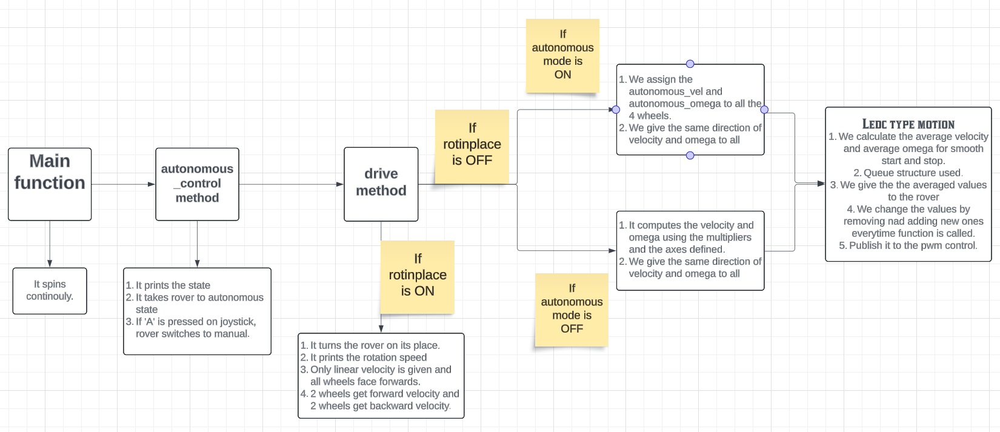

# TEAM ANVESHAK
## IROC_DRIVE documentation

The script relevant to this documentation can be found in the repository anveshak2683-RoverH2024 in the path __src/traversal2/scripts/iroc_drive_v1_with_102.py__


## Table of contents

This documentation contains the following elements for easy understanding and use of the program.

1. ROS Topics involved and methods called
1. Subscriber - Publisher relationship
1. Flow of control in the script 
1. Intuition on variable choosing and naming conventions followed

While the documentation is aimed to be understood in any order, it is preferable to skim the document, thoroughly understand the variable intuition and control flow before a complete reading of the documentation.

---
### ROS topics and methods

 Topic     | Type of message   | Callback Name              |       Callback Function                                                                                                                                                                                                                                         |
|-----------|-------------------|----------------------------|-----------------------------------------------------------------------------------------------------------------------------------------------------------------------------------------------------------------------------------------------------------------|
|    `joy`    | Joy               | `joyCallback`                | If in manual mode, it allows to change the steer configurations`(self.mode)`.`self.drive_ctrl` scales the inputs from joystick to change the pwm contrls with mode change. If `autonomous_btn` is pressed then irrespective of the state and mode, it should go auto. |
| `enc_drive` | Float32MultiArray | `enc_callback`               | It takes all the 4 values from data of `Float32` and stores in enc_data array.                                                                                                                                                                                    |
| `motion`    | Wheelrpm          | `autonomous_motion_callback` | It takes the velocity and omega and crab rotation boolean from the `Wheelrpm` message  and assigns it to `autonomous_vel, autonomous_omega and crab_rotate`.                                                                                                        |

### **Publishers**


| Topic     | Type of message | Callback Name |       Callback Function                                 |
|-----------|-----------------|---------------|---------------------------------------------------------|
| `motor_pwm` | Int32MultiArray | `pwm_pub`       | It is used to publish pwm velocities to all the motors. |
| `state`     | Boolean         | `state_pub`     | It defines the auto/manual state of the rover.          |

---

### Control flow
The following flowchart describes the control flow of the script during execution


---

#### Key functions and uses
In the function `autonomous_motion_callback(self,msg)`, 
```
if(self.state == True):
    self.autonomous_vel = 127 - msg.vel
    self.autonomous_omega = 127 - msg.omega  
    self.crab_rotate = msg.hb 
```
This function is used to offset for a previous implementation where a value of 127 corresponded to zero, a value less than 127 corresponds to moving forward and such. It is simply a linear transform to suit the new implementation.

In the function `joyCallback()`, 
```
if (self.steer_islocked == True):
            # mode up and down
            if(msg.buttons[self.modeupbtn] == 1):
                if(self.mode < 4):
                    self.mode = self.mode + 1
            if(msg.buttons[self.modednbtn] == 1):
                if(self.mode >0):
                    self.mode = self.mode - 1
```
is used to increment and decrement the speed levels for the rover. It is capped at a maximum `mode` value of 3 and a minimum value of 0. 

In the function `drive()`,
```
velocity = self.s_arr[self.mode] * self.drive_ctrl[0]
omega = self.s_arr[self.mode] * self.drive_ctrl[1]
```
the use of speed modes is shown by scaling the input values by the `self.s_arr[self.mode]` parameter.

---

### Variable intuition
#### Class variables
##### Defined and used in the script
1. `pwm_msg`:
    - An object of type `Int32MultiArray`, it holds the pwm message values for inputs to the motors on the rover.
    - In this code the first 4 integer values are used for \[front-left, front-right, back-left, back-right] PWM values for the motors. The other 4 values are left unused, while they can be used for extended functionality like axes selection and steering.
2. `modeupbtn`, `modedownbtn`:
    - Specifies the mapping of buttons on the joystick which perform the function of increasing and decreasing the `mode` of the rover - a scaling of the joystick input for the wheel speeds
3. `autonomous_btn`:
    - Allows toggling/enabling of the autonomous setting(the `state` variable) of the rover. This is also probably used in testing and debugging.
4. `steer_islocked`:
    - Conveys information about the state of the steering of the rover. 
    - A boolean `True` indicates that the steering is locked and the wheels cannot be steering, while `False` means the wheels can be steered.
4. `steering_complete`:
    - A boolean `True` means the wheels have all turned to the maximum value and 
5. `drive_ctrl`:
    - Holds the input values from the joystick in the \[fb_axis, lr_axis] form
    - These values are proportional to the values given to the motors to control them
6. `mode`:
    - The value used to choose the scaling applied to the values in `drive_ctrl` while selecting the motor driver speeds
    - A higher mode corresponds to a higher maximum speed of the wheel
    - Can be thought of as speed controlling gears
    - It is limited to the range \[0,3], which means the motors have four speed levels/states
7. `state`:
    - Specifies the state of the rover in terms of the control it is under in
    - A boolean value of `False` signifies manual control and a boolean `True` means autonomous control
8. `fb_axis`, `lr_axis`:
    - Specifies the mapping of the joystick buttons corresponding to fb and lr control.
    - Most commonly specifies the mapping to the throttle stick on the controller
9. `prints_per_iter`:
    - Used in the debugging information
    - Specifies the number of iterations for which the debug data is printed on the `stdout` or `stderr` devices
    - A higher value means the debug data is printed less frequently and helps in preventing the screen from being filled with data
10. `s_arr`:
    - Holds the scale values for the different `mode` values
    - The input data from the joystick is scaled using `s_arr[mode]`
    - Naturally, it holds higher values for higher value of `mode`
11. `enc_data`:
    - Holds the values for the encoder readings in the list with the conventional syntax for wheels
12. `qsize`:
    - Specifies the size of the queue used in the moving averaging
    - A larger value will enable the rover to move smoother, but will take more memory and computation
13. `vel_prev`, `omega_prev`:
    - Lists holding the values of the variables `vel` and `omega` for the past `qsize` instance counts
    - They are used in the implmentation of the moving average, and are appropriately modified everytime the `main()` method is called
14. `start_time`: 
    - An object of the type `time.time()`
    - Holds the value of the time at the start of the program
    - Can be used to know how long the program is running
15. `time_thresh`, `error_thresh`:
    - Can be used in debugging or high level control to stop the rover or perfrom a specific action when the threshold values are exceeded
16. `rotinplace`:
    - A boolean value specifying if the rover should execute a rotate in place motion
    - A rotate in place motion is implemented by making the wheels on the left side drive at a velocity in one direction, and the wheels on the other side rotate in the opposite direction with the same velocity
    - This enables the rover to change its direction without any linear displacement
    - This type of rotation is implemented when the rover wants to turn with its wheels perfectly oriented straight(`steer_islocked` is `True`)
    - This allows rotation of the rover without steering the wheels
17. `crab_rotate`:
    - This makes the rover rotate like a crab
    - The wheels turn 90 degrees without the rover being displaced and then moves parallelly to the desired position.
    - This rotation is like a displacement in a direction perpendicular to the front of the rover.
18. `autonomous_vel`, `autonomous_omega`:
    - Contains the values of velocity and omega for the rover when in autonomous control
    - The navigation stack's data for these variables is received during callback from the `motion` node


##### Defined but not used in the script
1. forward_btn
2. parallel_btn
3. rotinplace_btn
    - This button is used to set/toggle rotate in place feature. Probably involved during debugging/testing
4. steering_ctrl_locked
5. steering_ctrl_unlocked
6. steering_ctrl_pwm
7. steer_samedir_axis, steer_oppdir_axis

---
